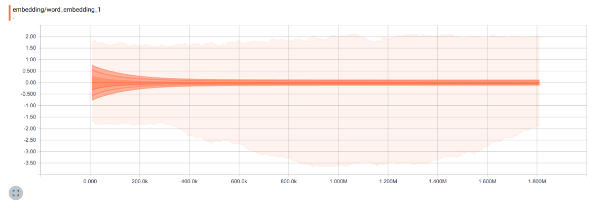

Embeddings - SkipGram
=====================

The software in here tries to learn how to represent words as small-is vector
by learning their meaning from context using the Skip-Gram model. See [here][1]
and [here][2] for more details. It ends up working fairly well when trained on
the [sanitized wikipedia text][3] - [text8][4].

TensorBoard does a very nice job visualizing the embedding. You can query for
similarities and the T-SNE display is not entirely horrible even for such a big
number of classes:

Also, the weight distribution over time in the embedding looks interesting:

[1]:http://papers.nips.cc/paper/5021-distributed-representations-of-words-and-phrases-and-their-compositionality.pdf
[2]: https://arxiv.org/pdf/1301.3781.pdf
[3]: http://mattmahoney.net/dc/textdata.html
[4]: http://mattmahoney.net/dc/text8.zip
