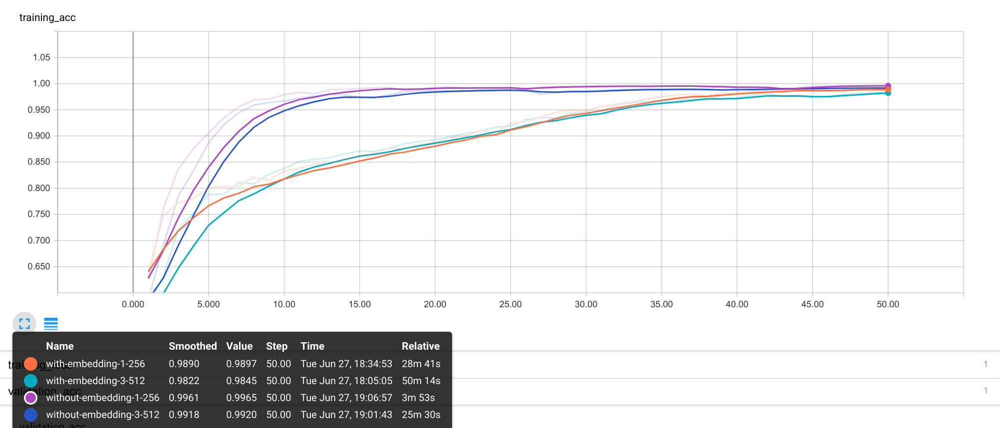
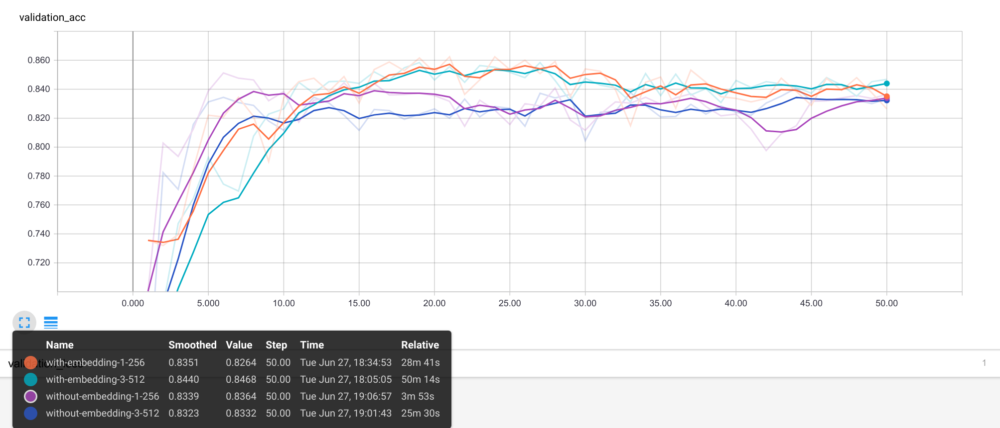

Sentiment Analysis Using a Recurrent Neural Network
===================================================

The programs in here do a sentiment analysis of text (movie reviews) using
a Recurrent Neural Network. They can either use pre-trained embeddings or not.
For the plots below Facebook's [FastText embeddings][1] were used. Udacity movie
review [dataset][2] was used for training. The example comments in here were
taken from IMDB.

[1]: https://github.com/facebookresearch/fastText/blob/master/pretrained-vectors.md
[2]: https://github.com/udacity/deep-learning/tree/master/sentiment-network
