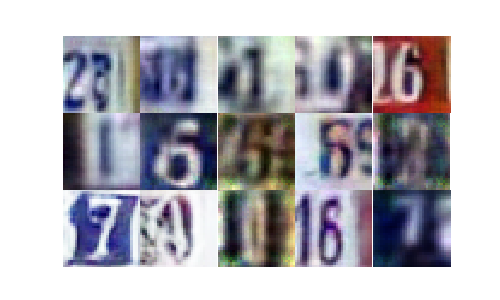

A generative-adversarial network to generate house numbers
==========================================================

Train a generative-adversarial network on house number images. This is a deep
convolutional network with normalization.

