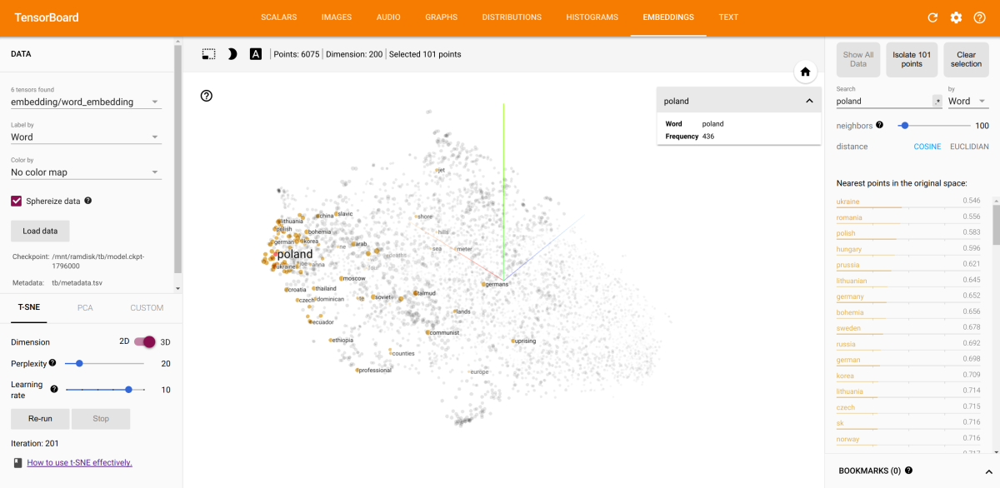
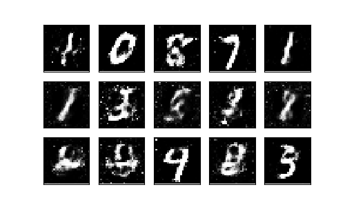

Deep Learning
=============

My musings related to deep learning.

Character-wise RNN for text generation
--------------------------------------

A sample from an RNN that trained on Anna Karenina:

> The steps, and the party
> started at the dining room, and the strange conversation was standing
> with a smile. The same words, the same though, and to bring a little
> shoulder, and the same smile, and the same strange face with which
> the priest and the past towards her, as though they were at the table,
> where a little girl would see how they had been the baby to them, and
> together at the table.
>
> "I'll tell you what I wanted to go to the country."
>
> "Well, then, I won't believe it," he said. "What am I to do? I want to
> do them, because I wanted to say..."
>
> "Yes," he said.
>
> "Well, then I'm natural and delicious, and I should not have thought of
> me, but that I could be so great the sake of me. If I do not ask you, to
> be a stranger and delightful tea on. The peasant was at a serious and
> the salary of him. It was an acquaintance."
>
> "Yes, yes," answered Levin, and stopped at the time with a
> smile, and the point was the only woman of the steps with his
> sharp arm and the carriage and the sharp health o

Embeddings - Skip-Gram
----------------------

Generate vector representations of words after infering meaning similarity from
the surrounding context.

Sentiment Analysis with RNN
---------------------------

Analyze sentiment of movie reviews using a Recurrent Neural Network and word
embeddings.

    ]==> ./test.py --embeddings-file wiki.en.npy review_1.txt --name embeddings-1-256
    [i] Project name:            embeddings-1-256
    [i] Network checkpoint:      embeddings-1-256/final.ckpt
    [i] Loading embeddings from: wiki.en.npy
    [i] Using embeddings:        True
    [i] Vocabulary size:         2518927
    [i] Loading the embedding...
    [i] Verdict:                 Positive

Word-wise RNN for text generation
---------------------------------

A sample from a network thrained on a subset of dialogs from The Simpsons.

    ]==> ./generate.py --name simpsons-moe --samples 500 --prime bart_simpson
    Project name:         simpsons-moe
    Network checkpoint:   simpsons-moe/final.ckpt
    LSTM size:            2048
    LSTM layers:          3
    Embedding size:       200
    Priming text:         bart_simpson
    Samples to generate:  200
    [i] Restoring a checkpoint from simpsons-moe/final.ckpt
    bart_simpson... (really, by sigh) " homer_simpson, i'm going to be a place dive.
    moe_szyslak: i got it used from the navy. you can flash-fry a buffalo in forty seconds.
    homer_simpson: forty seconds?   (whining) but i want it.

    homer_simpson: (ringing bell) hear ye, hear ye, my daughter has something to tell you about jebediah springfield.
    moe_szyslak: aw, the evening bedtime readin'.
    moe_szyslak: (snorts) nobody does.
    kemi: (portuguese) eu não quero dizer para mostrar (french) je ne veux pas montrer (spanish) no, sad, not this again.
    moe_szyslak: what?   it's 'cause of her i put in a bidet. well, it's actually just a step ladder by the water fountain.
    homer_simpson: now, you learn your numbers from perfect.
    bart_simpson: oh, yeah, can i look too?
    moe_szyslak: sure, but it'll cost somethin' how to make a job?

Sorting with an Encoder-Decoder RNN
-----------------------------------

Train a recurrent neural network to produce a sorted version of the input sequence.

    ]==> ./sort.py --seq=hello   
    [i] Project name:         test
    [i] Network checkpoint:   test/final.ckpt
    [i] LSTM size:            64
    [i] LSTM layers:          2
    [i] Max sequence length:  10
    [i] Sequence to sort:     hello
    [i] Restoring a checkpoint from test/final.ckpt
    [i] Sorted sequence:      ehllo

Generate MNIST digits with a generative adversarial network
-----------------------------------------------------------

My first attempt at training a generative-adversarial network on the MNIST data
to generate images of digits. It's a shalow network, both generator and
discriminator have only one hidden layer.

